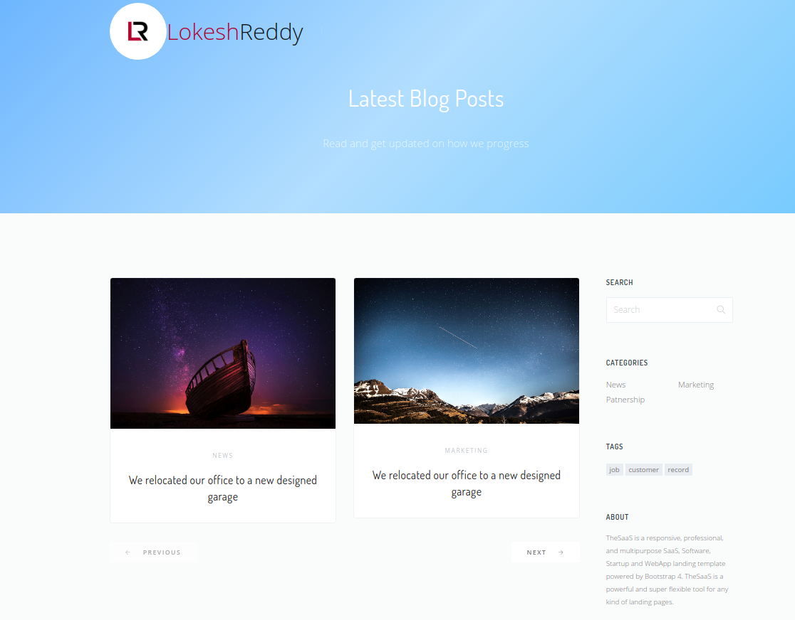
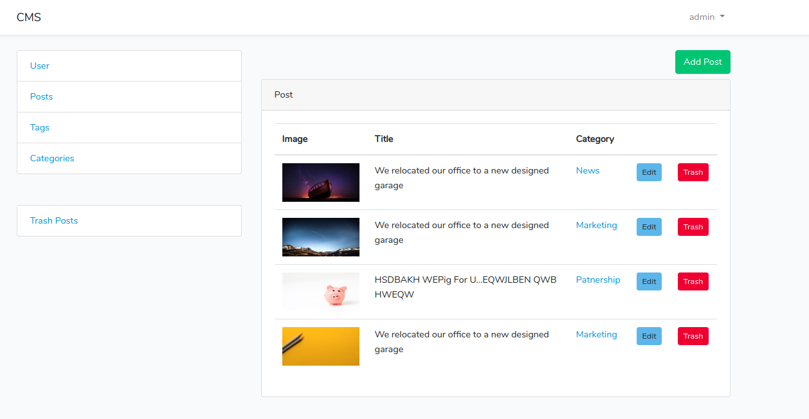
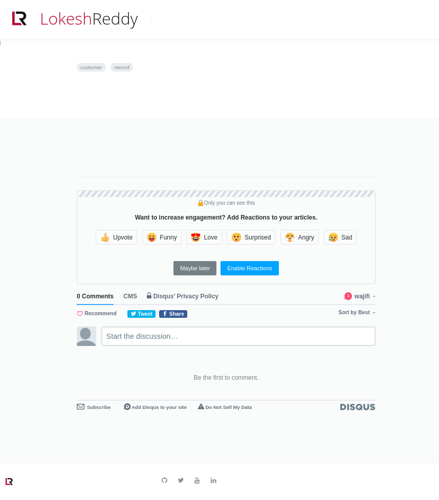

# CMS App with Laravel

| Features                                    | Implemented        |
| :------------------------------------------ | :----------------- |
| Authentication                              | :heavy_check_mark: |
| CRUD Post                                   | :heavy_check_mark: |
| CRUD Category                               | :heavy_check_mark: |
| CRUD Tags                                   | :heavy_check_mark: |
| Trash Post                                  | :heavy_check_mark: |
| Restore Post                                | :heavy_check_mark: |
| Published At option to add post dynamically | :heavy_check_mark: |
| Admin Dashboard                             | :heavy_check_mark: |
| User Dashboard                              | :heavy_check_mark: |
| Search by Post                              | :heavy_check_mark: |
| Filter by Tags                              | :heavy_check_mark: |
| Filter by Category                          | :heavy_check_mark: |
| Pagination                                  | :heavy_check_mark: |
| Disqus                                      | :heavy_check_mark: |
| Trix Editor                                 | :heavy_check_mark: |

#### Home Page

#### Dashboard

#### Discus

Got your attention. Interested in it, just fork it or clone and Start coding... :blush:
